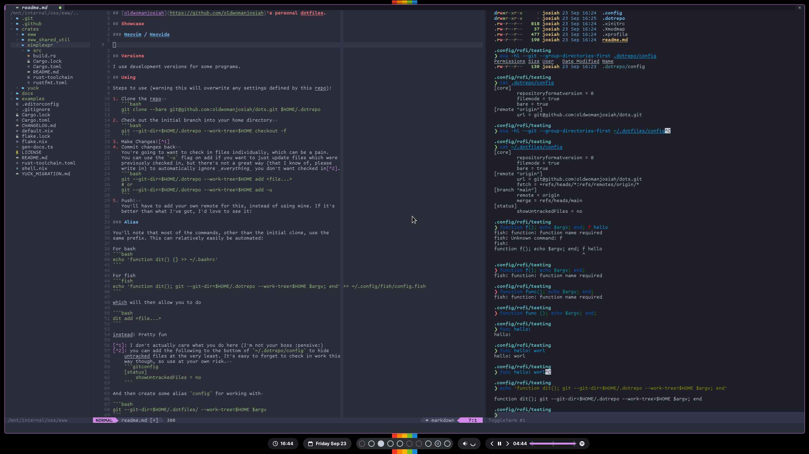
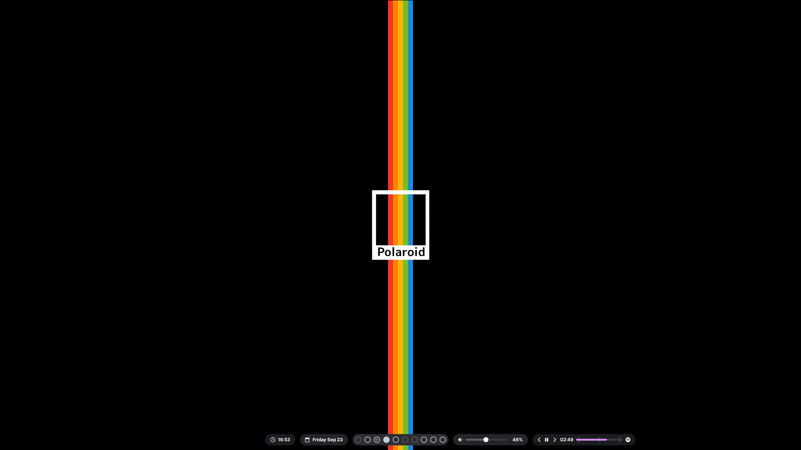

## [oldwomanjosiah](https://github.com/oldwomanjosiah)'s personal dotfiles.

## Showcase

### Neovim / Neovide



- [configs](./.config/nvim/)

### Eww (Status Bar)




- [configs](./.config/eww/)
- [scripts](./.config/eww/)  
  Please don't judge my rust skills based off of `playerctl_spot`, I just wanted
  to replace a bash script that was super unweildy.
  - It's not published anywhere so you'll have to build from source[^3].

## Versions

For the most part I use the stable variants of the programs configured here,
with the following special cases.

### [Eww](https://github.com/elkowar/eww)

I used a patched version which can be found in it's entirety
[here](https://github.com/oldwomanjosiah/eww/tree/josiah/both). It includes
changes from the two following PRs, which may have been upstreamed by the time
you are reading this:

- https://github.com/elkowar/eww/pull/577
- https://github.com/elkowar/eww/pull/578

### [Picom](https://github.com/yshui/picom)

I currently use the [ibhagwan fork](https://github.com/ibhagwan/picom) on my desktop.

## Using

Steps to use (warning this will overwrite any settings defined by this repo):

1. Clone the repo  
   ```bash
   git clone --bare git@github.com:oldwomanjosiah/dots.git $HOME/.dotrepo
   ```
2. Check out the initial branch into your home directory  
   ```bash
   git --git-dir=$HOME/.dotrepo --work-tree=$HOME checkout -f
   ```
3. Make Changes![^1]
4. Commit changes back  
   You're going to want to check in files individually, which can be a pain.
   You can use the `-u` flag on add if you want to just update files which were
   previously checked in, but there's not a great way (that I know of, please
   write in) to automatically ignore _everything_ you don't want checked in[^2].
   ```bash
   git --git-dir=$HOME/.dotrepo --work-tree=$HOME add <file...>
   # or
   git --git-dir=$HOME/.dotrepo --work-tree=$HOME add -u
   ```
5. Push!  
   You'll have to add your own remote for this, instead of using mine. If it's
   better than what I've got, I'd love to see it!

### Alias

You'll note that most of the commands, other than the initial clone, use the
same prefix. This can relatively easily be automated:

For bash
```bash
echo 'function dit() {} >> ~/.bashrc'
```

For fish
```fish
echo 'function dit(); git --git-dir=$HOME/.dotrepo --work-tree=$HOME $argv; end' >> ~/.config/fish/config.fish
```

which will then allow you to do

```bash
dit add <file...>
```

instead! Pretty fun

[^1]: I don't actually care what you do here (I'm not your boss :pensive:)
[^2]: you can add the following to the bottom of `~/.dotrepo/config` to hide
    untracked files at the very least. It's easy to forget to check in work this
    way though, so use at your own risk.  
    ```gitconfig
    [status]
        showUntrackedFiles = no
    ```
[^3]: You'll need a recent [stable rust toolchain](https://rustup.rs), and to
    run the following (be sure you want to do this, I'm practically a stranger).
    ```bash
    cd ~/.config/eww/scripts/playerctl_spot/
    cargo install --path .
    ```
